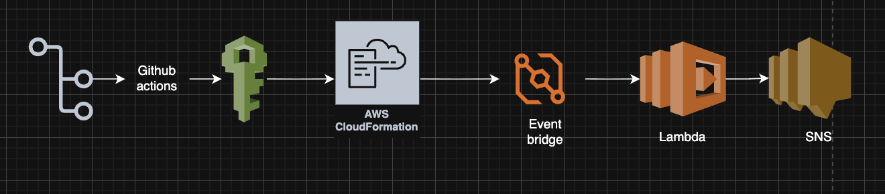
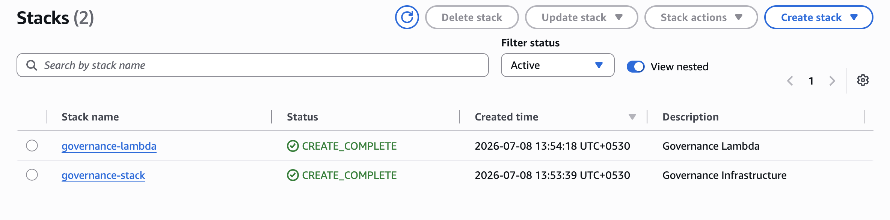

Problem Statement

Organizations face challenges such as:

- Uncontrolled cloud resource creation
- Missing ownership tags
- Increased operational costs
- Lack of governance visibility
- Manual compliance auditing

This project automates the monitoring process and helps maintain governance standards while supporting FinOps best practices.

Solution

This project uses an event-driven architecture to monitor AWS account activity.

When infrastructure events occur:

1. CloudTrail captures AWS API activity.
2. EventBridge detects the event.
3. Lambda executes governance validation logic.
4. SNS sends notifications to administrators.
5. CloudWatch Logs store execution logs for auditing.

GitHub Actions automatically:

- Validates CloudFormation templates
- Deploys Governance Stack
- Deploys Lambda Stack
- Configures EventBridge
- Creates IAM Roles
- Creates SNS Topic

---

# Architecture Diagram

  

---

# CloudFormation Stacks

  

